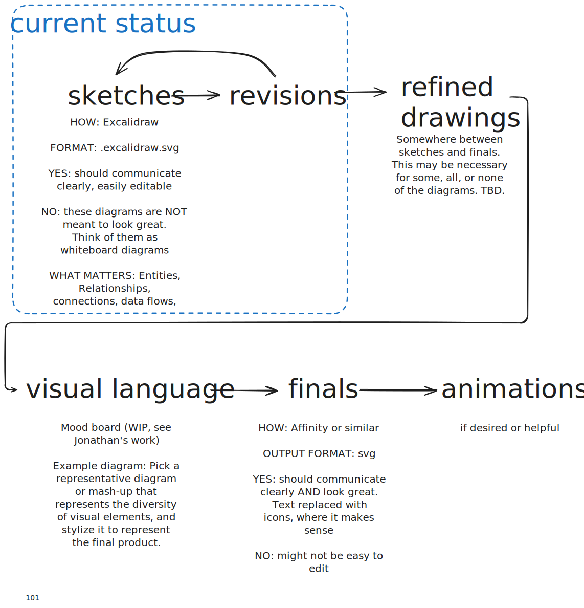
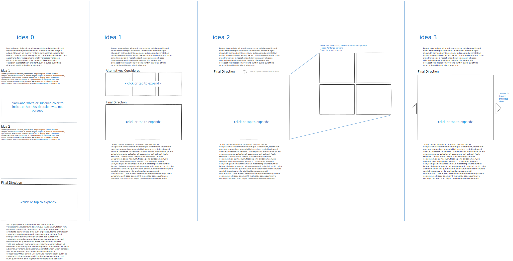
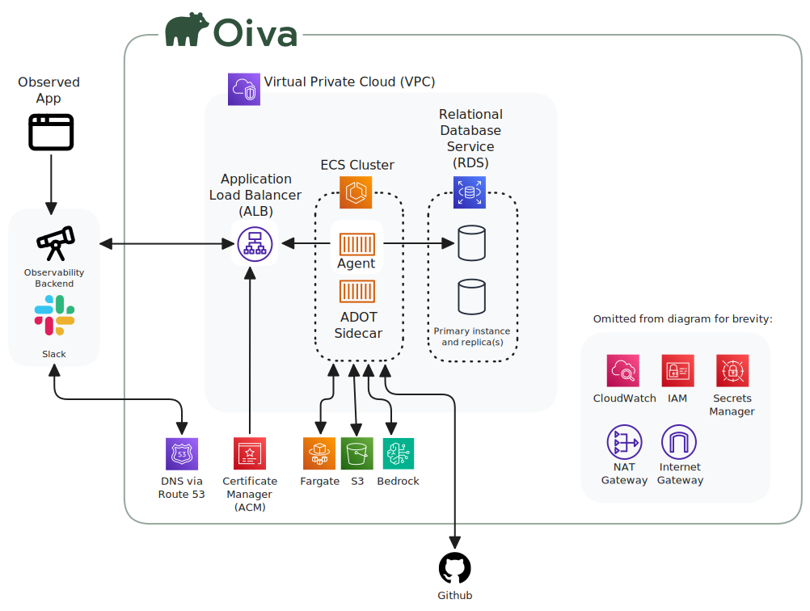
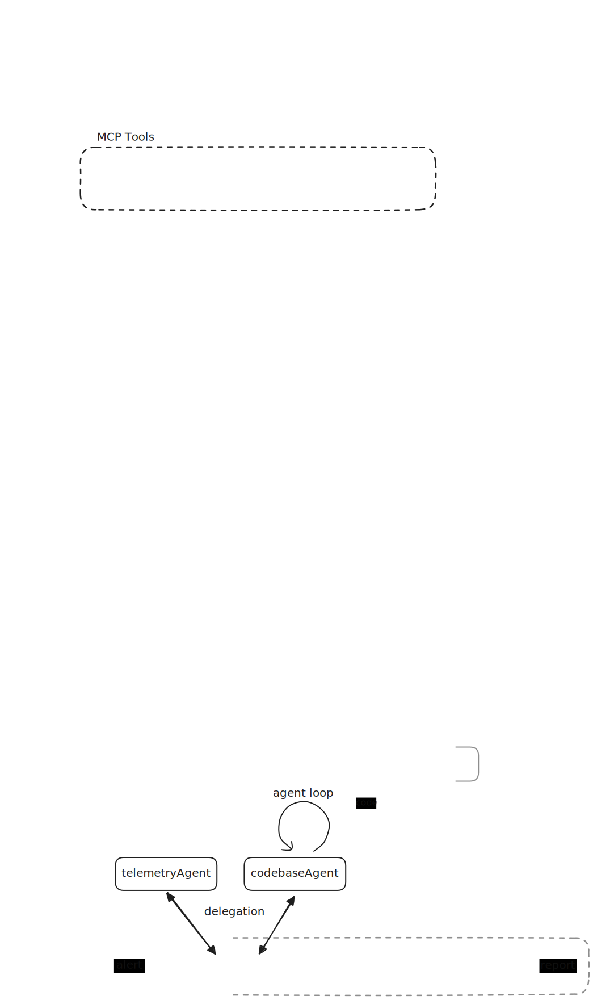
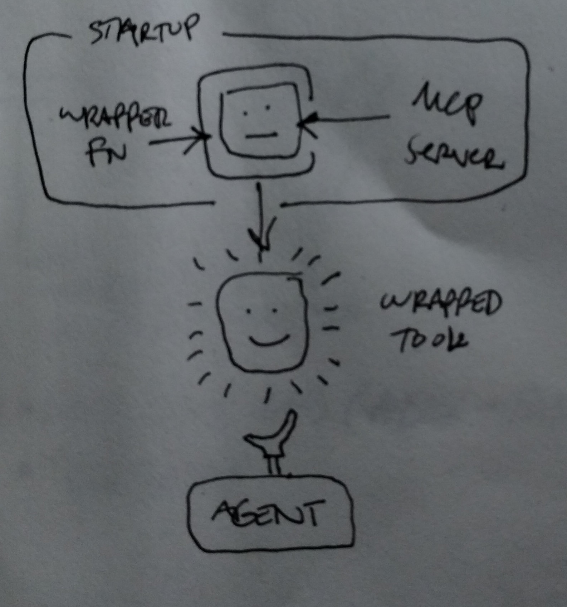

## meta

### Numbering
Numbers are a best-guess at the final order the diagrams will appear in the final document.  These numbers are not perfect, but they are a lot better than just starting from 0 and adding 1 with no best-guess, as diagrams would appear *very* out of order in that scenario, when sorted by filename.  

Why not just drop the numbers and use filenames only?  
1. For the same reason that SKU's were invented.  It's helpful to have a short, unambiguous serial number for every graphic
2. It's helpful to be able to view related files next to each other in the file explorer, when sorted alphabetically

### Production Process
About the diagrams and diagramming process

### Formatting / presentation ideas

## overview

### User experience

### How it works
A vendor agnostic overview of Oiva

Our current implementation

## System Archtecture

### Simplified Architecture
TBD - based on what is needed by the Case Study text.  These diagrams will be somewhere between these two extremes:
- [101-overall-design.excalidraw](100-intro/101-overall-design.excalidraw.svg)
- [690-final-infra.excalidraw](600-infra/690-final-infra.excalidraw.svg)

### Full Architecture
Here's the full diagram, with all the gory details.  Simplified diagrams will be created as necessary for clear communication.

Idea: animate from least complex to most complex?

## Agent Architecture

### tool Wrapper

This diagram is currently pretty terrible and will be improved or removed

